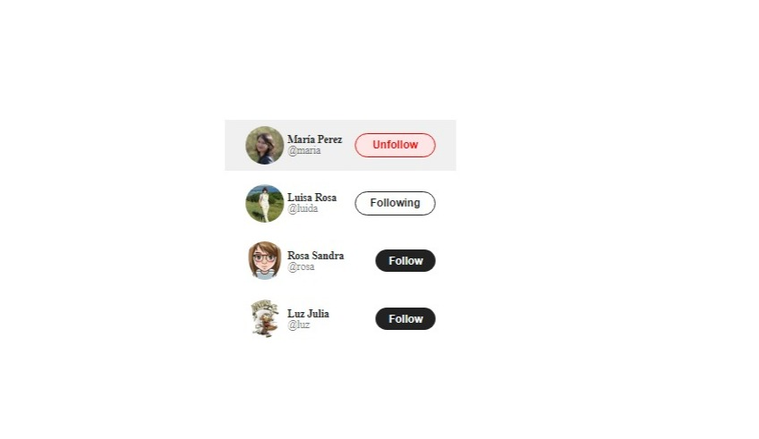

# Proyecto: interfazTwitterSimulacion


## Descripción del Proyecto

**interfazTwitterSimulacion** es un proyecto configurado y desarrollado con **Vite** que presenta una interfaz elegante y dinámica para gestionar las relaciones de seguimiento en una plataforma similar a Twitter. Este proyecto incluye un componente principal que se renderiza como una tarjeta (`card`), mostrando la imagen del usuario, el nombre de usuario (`userName`) y un botón de seguimiento dinámico. El diseño y la interactividad del componente se han implementado con las mejores prácticas de desarrollo web para asegurar una experiencia de usuario fluida y atractiva.

### Características

- **Componentización:** Cada elemento de la interfaz está estructurado en componentes reutilizables y modulares.
- **Estilo Dinámico:** El botón de seguir cambia su estado dinámicamente, proporcionando una respuesta visual inmediata al usuario.
- **Desempeño Optimizado:** Configurado con Vite para asegurar tiempos de carga rápidos y un desarrollo eficiente.
- **Estilos Personalizados:** Utilización de CSS moderno para una apariencia limpia y profesional.

### Tecnologías Utilizadas

- **React:** Biblioteca de JavaScript para construir interfaces de usuario. Permite construir aplicaciones de una sola página (SPA) de manera eficiente y sencilla, utilizando componentes reutilizables que gestionan su propio estado.
- **Vite:** Herramienta de desarrollo rápida y ligera que facilita la configuración del proyecto y mejora el tiempo de construcción.
- **JavaScript:** Lenguaje de programación esencial para la interactividad del componente.
- **CSS:** Lenguaje de estilos utilizado para diseñar y personalizar la apariencia del componente.

### Capturas de Pantalla



### Instalación

Para instalar y ejecutar este proyecto localmente, sigue estos pasos:

1. Clona este repositorio:
   ```sh
   git clone git@github.com:Alvenisj/interfazTwitterSimulacion.git
   ```
2. Navega al directorio del proyecto:
   ```sh
   cd interfazTwitterFollowing
   ```
3. Instala las dependencias:
   ```sh
   npm install
   ```
4. Inicia el servidor de desarrollo:
   ```sh
   npm run dev
   ```

### Uso

Una vez que el servidor de desarrollo esté en funcionamiento, abre tu navegador y navega a `http://localhost:3000` para ver la interfaz en acción. Puedes interactuar con el botón de seguir para ver la funcionalidad dinámica en tiempo real.

### Contribución

Si deseas contribuir a este proyecto, por favor sigue estos pasos:

1. Haz un fork del proyecto.
2. Crea una nueva rama con tus cambios:
   ```sh
   git checkout -b mi-nueva-rama
   ```
3. Realiza tus modificaciones y haz commit:
   ```sh
   git commit -m 'Descripción de mis cambios'
   ```
4. Empuja tus cambios a la rama:
   ```sh
   git push origin mi-nueva-rama
   ```
5. Abre un Pull Request.

### Licencia

Este proyecto es de código abierto y no tiene una licencia específica. Puedes usar, modificar y distribuir el código según tus necesidades. Sin embargo, ten en cuenta que, sin una licencia explícita, no se ofrecen garantías ni responsabilidades por el uso del código.

---

¡Gracias por visitar este proyecto! Si tienes alguna pregunta o sugerencia, no dudes en contactarme.
